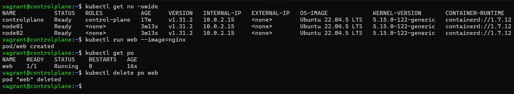

# Vagrant Kubernetes Setup

This repository contains a `Vagrantfile` to provision a Kubernetes cluster using Vagrant. It includes all necessary configurations for setting up and managing virtual machines for learning and testing Kubernetes.

---

## Result Screenshot
<p align="center">

</p>

## Prerequisites

- [Vagrant](https://developer.hashicorp.com/vagrant/install)
- [VirtualBox](https://www.virtualbox.org/wiki/Downloads)
- An internet connection
- 8GB RAM (minimum)
- 30GB free disk space

---

## Getting Started

### 1. Clone the Repository
```bash
git clone https://github.com/jagrit007/k8s_vagrant_kubeadm
cd k8s_vagrant_kubeadm
```

### 2. Start the Virtual Machines
To bring up the VMs defined in the `Vagrantfile`:
```bash
vagrant up
```

### 3. Check the Status of the VMs
To see the status of your VMs:
```bash
vagrant status
```

### 4. SSH into a VM
To access a VM:
```bash
vagrant ssh <vm-name>
```

### 5. Destroy the VMs
To clean up and remove the VMs:
```bash
vagrant destroy
```

---

## Troubleshooting

### Flannel Crash: `Failed to check br_netfilter`
If you encounter the error:
```
Failed to check br_netfilter: stat /proc/sys/net/bridge/bridge-nf-call-iptables: no such file or directory
```
Follow these steps:

1. **Enable the `br_netfilter` Kernel Module**
   ```bash
   sudo modprobe br_netfilter
   ```

2. **Persist the Module Across Reboots**
   ```bash
   echo "br_netfilter" | sudo tee /etc/modules-load.d/br_netfilter.conf
   ```

3. **Enable Bridge Networking Configuration**
   ```bash
   sudo sysctl -w net.bridge.bridge-nf-call-iptables=1
   sudo sysctl -w net.bridge.bridge-nf-call-ip6tables=1
   ```

4. **Persist Sysctl Settings**
   ```bash
   echo "net.bridge.bridge-nf-call-iptables=1" | sudo tee -a /etc/sysctl.conf
   echo "net.bridge.bridge-nf-call-ip6tables=1" | sudo tee -a /etc/sysctl.conf
   sudo sysctl --system
   ```

5. **Restart the Flannel Pod**
   ```bash
   kubectl delete pod kube-flannel-ds-<id> -n kube-flannel
   ```

---

## Special Thanks

A huge thanks to **[KodeKloud](https://learn.kodekloud.com/)** for their **Certified Kubernetes Administrator (CKA) course** and resources, which have been invaluable in understanding Kubernetes concepts and troubleshooting effectively.  

Special thanks also go to the **KodeKloud Community** for their incredible support and helpful discussions! ([KodeKloud Community](https://kodekloud.com/community/))